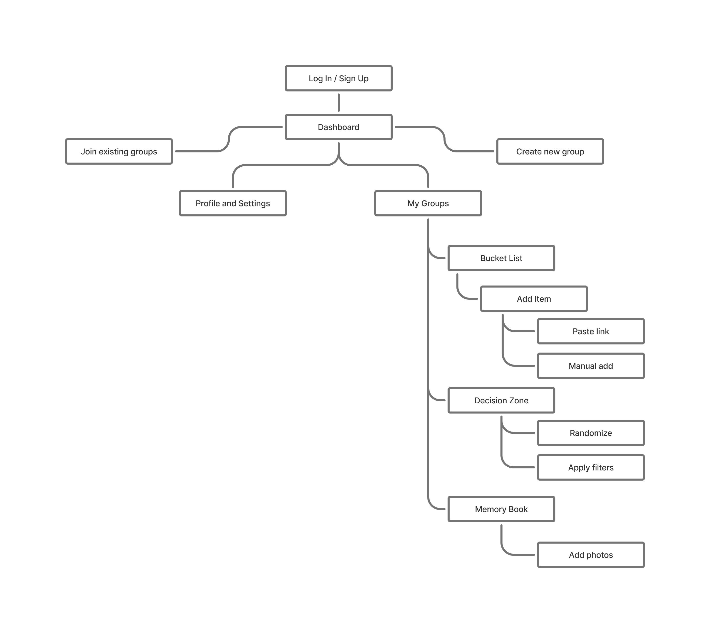

# User Experience Design

## App Map

The app map shows the hierarchical structure of the application. Users start at the Log In / Sign Up screen, then proceed to the Dashboard, which serves as the central hub. From the Dashboard, users can join existing groups, create new groups, access their Profile and Settings, or navigate to My Groups. Within My Groups, users can manage their Bucket List (adding items via paste link or manual entry), use the Decision Zone (with randomize or filter options), and contribute to the Memory Book by adding photos of completed experiences.
