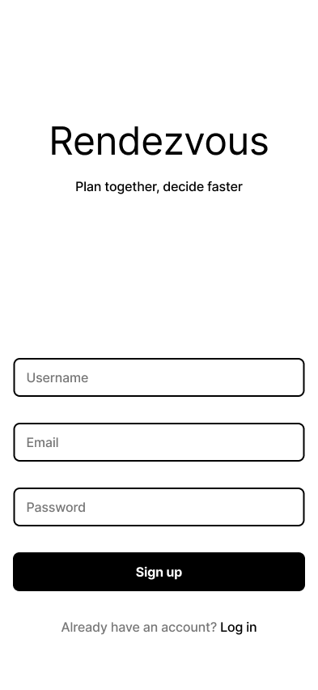
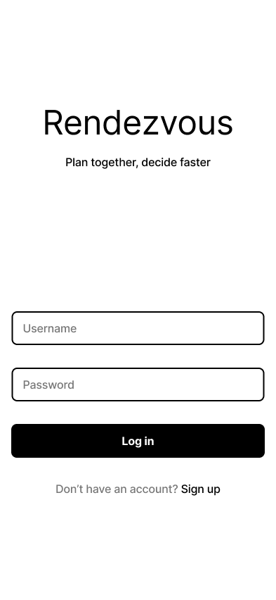
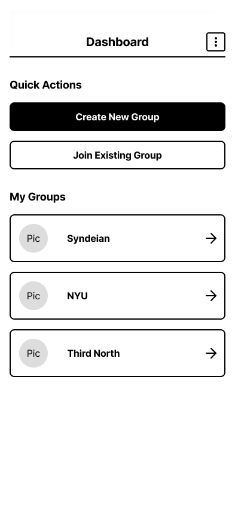
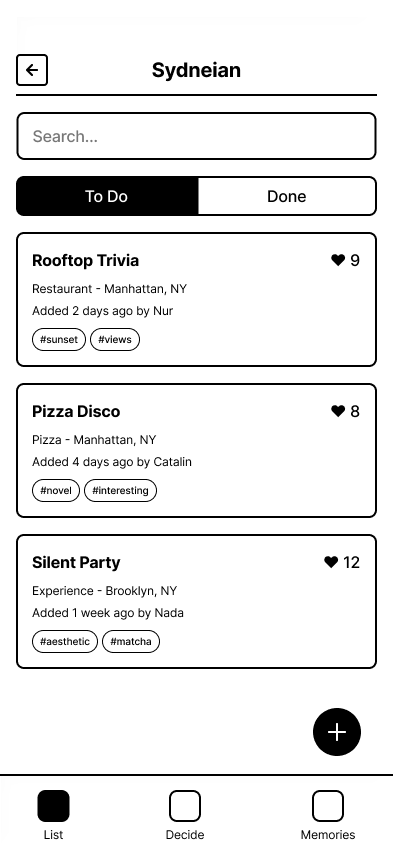
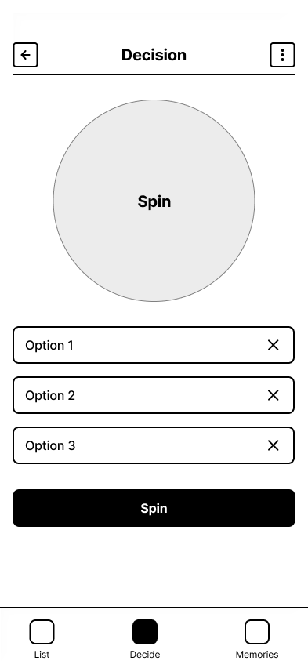
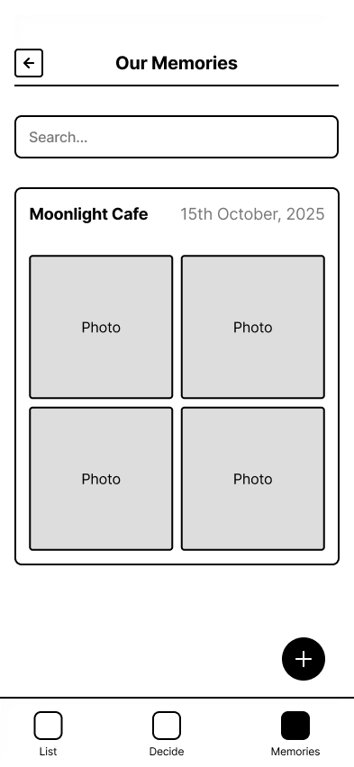

# User Experience Design

## App Map

The app map shows the hierarchical structure of the application. Users start at the Log In / Sign Up screen, then proceed to the Dashboard, which serves as the central hub. From the Dashboard, users can join existing groups, create new groups, access their Profile and Settings, or navigate to My Groups. Within My Groups, users can manage their Bucket List (adding items via paste link or manual entry), use the Decision Zone (with randomize or filter options), and contribute to the Memory Book by adding photos of completed experiences.

## Wireframes

### Register / Log In

The authentication screens provide entry points for both new and returning users. Both screens display the Rendezvous branding with the tagline "Plan together, decide faster." The Register screen includes input fields for username, email/phone number, and password with a "Sign up" button and a link to log in. The Log In screen features simplified fields for username and password with a "Log in" button and a link to sign up for new users.

### Dashboard

The Dashboard serves as the main hub after login. It features Quick Actions buttons for creating a new group or joining an existing group. Below that, the My Groups section displays a list of all groups the user belongs to, each with a navigation arrow to access the group's bucket list.

### Bucket List

The Bucket List screen shows all items for a selected group. Users can toggle between "To Do" and "Done" tabs to view pending or completed items. Each bucket list item card displays the place name, location, who added it, when it was added, and category tags. A floating action button at the bottom allows users to add new items to the list.

### Add Item

The Add Item screen provides two methods for adding bucket list items: "Paste Link" for importing from social media or web sources, and "Add Manually" for custom entries. The screen displays Recent Additions as reference examples showing places that have been added.

### Add Through Link

This screen allows users to import bucket list items by pasting TikTok or Instagram links. After entering a URL and clicking "Import Details," a preview section displays the extracted information including an image placeholder, place name, location, and highlights. Users can optionally add tags before clicking "Add to Bucket List" to save the item.

### Add Manually

The Add Manually screen provides form fields for users to input place details directly, including place name, location, category dropdown, description text area, and tags. A dashed box allows users to add photos, and a button at the bottom adds the item to the bucket list.

### Decision Wheel

The Decision Wheel helps groups choose which bucket list item to tackle next. It displays a circular wheel with a "Spin" button in the center. Below the wheel are three option slots that can be populated with bucket list items. Users can remove items from the wheel using the X button next to each option, then spin to randomly select an activity.

### Filters

The Filters screen allows users to narrow down bucket list options by category and location. Multiple dropdown fields are provided for each filter type, enabling users to apply multiple criteria simultaneously to help with decision-making.

### Memory Book

The Memory Book displays completed experiences with photos. It shows the activity name and date at the top, with a grid of photo placeholders below where users can view memories from completed bucket list items. A search bar at the top allows users to find specific memories.

## Prototype

[Prototype](prototype link)

The interactive prototype demonstrates the core user flows of the Rendezvous application:

**Authentication Flow:** Users can navigate between the registration and login screens to create an account or sign in to an existing one.

**Group Management:** From the Dashboard, users can create new groups, join existing groups, or select from their current groups to view the associated bucket list.

**Bucket List Management:** Within a group, users can view all bucket list items, toggle between "To Do" and "Done" tabs, and add new items either by pasting social media links or manually entering details.

**Decision Making:** Users can access the Decision Wheel to randomly select a bucket list item or use filters to narrow down options based on category and location preferences.

**Memory Capture:** After completing activities, users can document their experiences in the Memory Book by adding photos and viewing past memories.

The prototype allows stakeholders to experience the app's navigation flow and understand how users will interact with key features before development begins.
